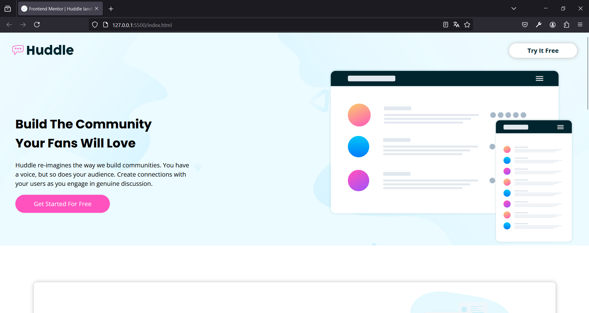

# Frontend Mentor - Huddle landing page with alternating feature blocks solution

This is a solution to the [Huddle landing page with alternating feature blocks challenge on Frontend Mentor](https://www.frontendmentor.io/challenges/huddle-landing-page-with-alternating-feature-blocks-5ca5f5981e82137ec91a5100). Frontend Mentor challenges help you improve your coding skills by building realistic projects. 

## Table of contents

- [Overview](#overview)
  - [The challenge](#the-challenge)
  - [Screenshot](#screenshot)
  - [Links](#links)
- [My process](#my-process)
  - [Built with](#built-with)
  - [What I learned](#what-i-learned)
  - [Continued development](#continued-development)
  - [Useful resources](#useful-resources)
- [Author](#author)
- [Acknowledgments](#acknowledgments)
## Overview

### The challenge

Users should be able to:

- View the optimal layout for the site depending on their device's screen size
- See hover states for all interactive elements on the page

### Screenshot



### Links

- Solution URL: [Add solution URL here](https://your-solution-url.com)
- Live Site URL: [https://huddlelanind-blocks.netlify.app]

## My process

### Built with

- Semantic HTML5 markup
- CSS custom properties
- Flexbox
- CSS Grid

### What I learned

Use this section to recap over some of your major learnings while working through this project. Writing these out and providing code samples of areas you want to highlight is a great way to reinforce your own knowledge.

To see how you can add code snippets, see below:

```html
<h1>Some HTML code I'm proud of</h1>
      <div class="footer__links">
        <div class="footer__contact-container">
          <div class="footer__contact">
            
            <p>Lorem ipsum dolor sit, amet consectetur adipisicing elit.<span class="salto"></span> Animi accusamus eos odit excepturi perspiciatis<span class="salto"></span> reiciendis delectus exercitationem itaque in eveniet.</p>
          </div>
  
          <div class="footer__contact">
            
            <p>+1-543-123-4567</p>
          </div>
  
          <div class="footer__contact">
            
            <p>example@huddle.com</p>
          </div>
        </div><!-- footer contact -->

        <div class="links">
          <a href="#">About Us</a>
          <a href="#">What We Do</a>
          <a href="#">FAQ</a>
        </div>

        <div class="links">
          <a href="#">Career</a>
          <a href="#">Blog</a>
          <a href="#">Contact Us</a>
        </div>

        <div class="social-media">
          <a href="#"></a>
          <a href="#"></a>
          <a href="#"></a>
        </div>
      </div><!--footer links -->
```
```css
.proud-of-this-css {
  .footer{
    background-color: var(--VeryDarkCyan);
    padding: 4rem 2rem 2rem 2rem;
    margin-top: -5rem;
    position: relative;
    z-index: 1;
}

}
```

### Continued development

Im keeping doing Front End challenges because i want to live with this. This is the present and the future and i want to enjoy.

### Useful resources

- [CSSMatic](https://www.https://www.cssmatic.com/es/box-shadow.com) - This helped me to make the box shadows.

## Author

- Frontend Mentor - [@AlbertoVaMa](https://www.frontendmentor.io/profile/AlbertoVaMa)
- Twitter - [@Betungas18](https://www.twitter.com/https://x.com/Betungas18)

## Acknowledgments

My tip is do it alone, trying by yourself until yout head explodes, if you cant, use a resource and keep going but never stop.
